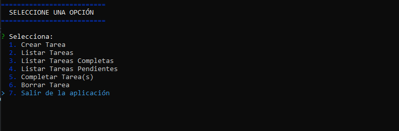
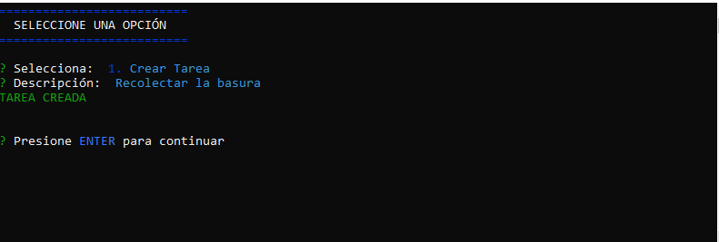
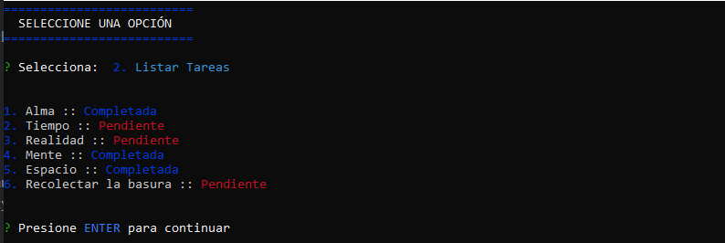
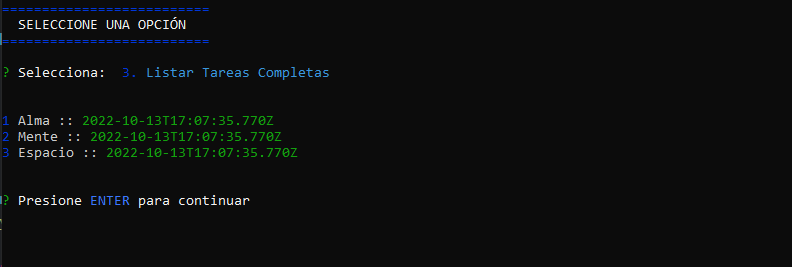
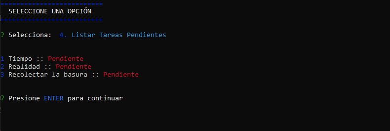
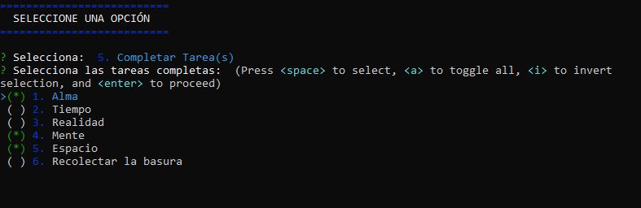
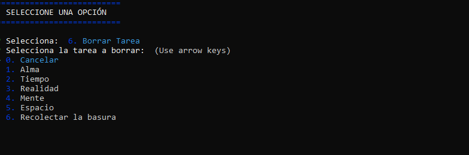

<h1>Management Tasks</h1>

<p>Management Tasks is a console app that allows to organize any type of tasks. You can create, list and delete tasks with an intuitive interface. Although it has many options to manipulate the tasks, this app save your tasks despite the app ends its execution thanks to a JSON file.</p>

<p>If you want to execute this app in your device, download the code and execute:</p>

```
npm install
```

<p>It's important to mention that you must have installed Node.js to run this project.</p>

The above command will download the required dependencies. These dependencies are:

<ul>
<li>
<p>inquirer v9.0.0</p>
</li>
<li>
<p>colors v1.4.0</p>
</li>
<li>
<p>uuid v9.0.0</p>
</li>
</ul>
<br>

<p>Once you have the app, run it with the following command: </p>

```
node app
```
<br>

<h2>Technologies and development</h2>
<br>
<ul style="list-style: square;">
<li>
      <p>Node.js</p>
</li>
<li>
      <p>Object Oriented Programming</p>
</li>
<li>
      <p>JSON</p>
</li>
<li>
      <p>Asynchronous Functions</p>
</li>
</ul>
<br>

<h2>Interface application</h2>
<br>

<p>Menu Options</p>

<br>
<br>

<p>Create Task</p>

<br>
<br>

<p>List All Tasks</p>

<br>
<br>

<p>List only completed Tasks</p>

<br>
<br>

<p>List only pending Tasks</p>

<br>
<br>

<p>Mark as completed some tasks</p>

<br>
<br>

<p>Delete tasks</p>

<br>
<br>